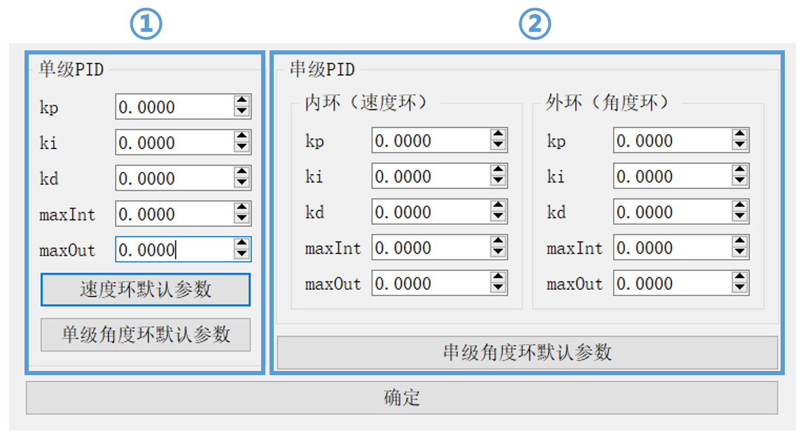
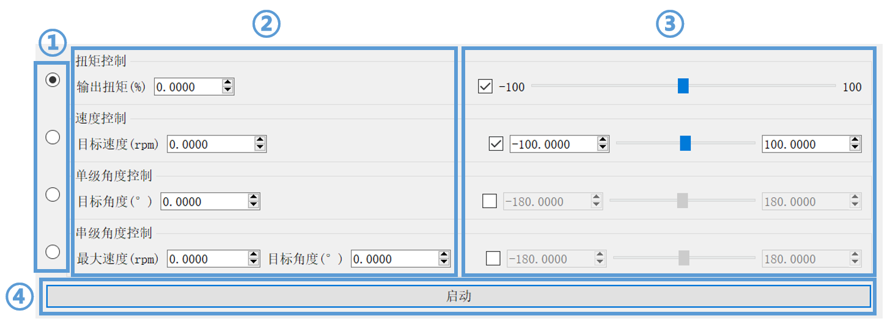
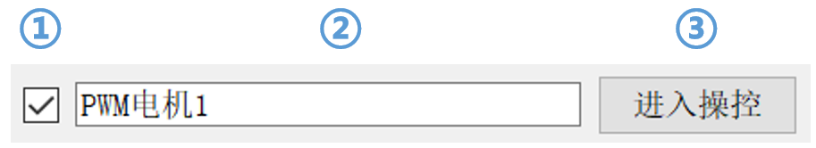
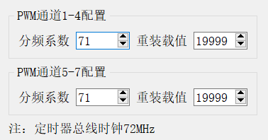
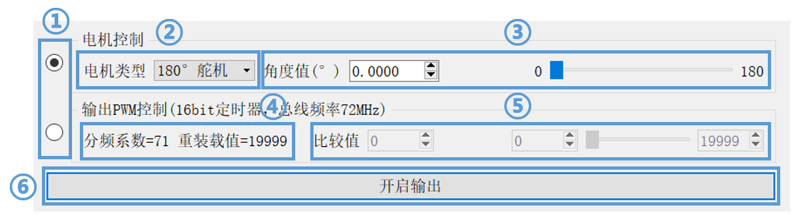

# MotorController

---

## 目录

[toc]

---

## 简介

`MotorController`是专门为RoboMaster比赛相关电机编写的控制程序，用户可以很方便地使用电脑软件操控电机的动作。目前下位机使用大疆官方C板，上位机支持Windows环境；程序支持部分CAN通信控制的电机和PWM控制的电机，支持的电机型号或类型如下：

* 大疆M3508电机

* 大疆GM6020电机

* 大疆M2006电机

* 180°舵机

* 270°舵机

* 其他使用PWM控制的电机(配置较复杂)

---

## 使用说明

---

### 快速使用步骤

0. 准备工作：将下位机程序烧入主控板(一块主控板只需进行一次)

1. 为电机和主控板连接电源(主控板绿色LED闪烁表示工作正常)

2. 连接电机和主控板间的信号线

3. 使用USB数据线将主控板与电脑相连

4. 打开软件，搜索并打开对应串口

5. 使用CAN电机的步骤

	* 在主界面配置电机基本信息

	* 打开PID配置窗口配置PID参数(若电机负载较小可以使用默认参数)

	* 打开操控窗口进行电机操控

6. 使用PWM电机的步骤

	* 在主界面配置电机基本信息

	* 打开操控窗口，选择电机类型，进行操控

	* 若需进行更为详细的PWM配置，可在主界面打开定时器配置窗口进行分频系数和重装载值的设定，并在操控窗口进行比较值的修改

---

### 详细功能介绍

---

#### CAN电机控制

##### 主界面

1. 电机使能控制，若需开启对应电机控制需要勾选

2. 电机标识名称，可以填入为该电机的备注名称

3. 电机类型选择

4. 电机ID选择，须填入实际电机配置的ID号

5. 打开PID配置窗口

6. 打开操控窗口

##### PID配置界面

1. 配置单级PID，进行恒速控制或单级角度控制时使用该参数

2. 配置串级PID，进行串级角度控制时使用该参数

###### 说明

* 下方的`速度环默认参数`、`单级角度环默认参数`和`串级角度环默认参数`按钮可以根据所选择的电机型号填入一组默认参数，默认参数在电机负载较小时有较好控制效果

* PID各配置项含义

	* `kp`比例系数

	* `ki`积分系数

	* `kd`微分系数

	* `maxInt`积分限幅(maxIntegral)

	* `maxOut`输出限幅(maxOutput)

##### 操控界面

1. 选择操控模式

2. 修改控制量，可以直接在编辑框内键入，或在编辑框上滚动滚轮

3. 使用滑块修改控制量，可以在编辑框内配置滑块对应的上下限值，注意使用前需勾选左端的复选框

4. 启动或停止电机运转

###### 说明

* 各控制模式说明

	* 扭矩控制：控制电机输出扭矩占最大扭矩的百分比

	* 速度控制：控制电机恒速旋转的目标速度

	* 单级角度控制：使用单级PID控制电机的目标角度

	* 串级角度控制：使用串级PID控制电机的目标角度，同时可以设定旋转时的最大速度

* 使用速度控制时，设定的是电机**转子**的旋转速度

* 使用单级或串级角度控制时，设定的是电机**输出轴**的累计旋转角，当从其他模式切换为这两个模式时电机角度累计值归零

---

#### PWM电机控制

##### 主界面

1. 电机使能控制，若需开启对应电机控制需要勾选

2. 电机标识名称，可以填入为该电机的备注名称

3. 打开操控窗口

##### 定时器配置界面

###### 说明

* 两个定时器的总线时钟频率都为72MHz

* 7个PWM输出通道中，通道1-4和通道5-7分别属于一个定时器，分别共用一组分频系数和重装载值

##### 操控界面

1. 选择操控模式

2. 选择PWM控制的电机类型

3. 设定控制量

4. 该PWM通道所在定时器的当前配置，如需修改需从主界面进入定时器配置窗口

5. 设定PWM通道比较值

6. 开启或关闭该PWM通道的输出

###### 说明

* 切换为电机控制模式时，该通道所在定时器会被自动配置为该电机类型所需的参数，属于同一定时器的其他通道也会受到影响。电机类型与定时器参数对应如下：
  
	* 180°舵机：分频系数=71，重装载值=19999

	* 270°舵机：分频系数=71，重装载值=19999

* 各电机类型的PWM对应关系

	* 180°舵机：角度值0-180对应比较值500-2500，即高电平时间0.5-2.5ms

	* 270°舵机：角度值0-270对应比较值500-2500，即高电平时间0.5-2.5ms

---

#### 其他操作介绍

##### 导入导出

在`菜单`中可以看到`导入配置`和`导出配置`两个选项，可以将当前的配置导出为一个配置文件，或载入一个配置文件中的数据

* 配置文件的格式为INI格式

* 以下数据会被导入导出

	* 电机配置信息，包含电机使能状态、电机标识名称、电机类型、电机型号、电机ID、PID参数

	* 电机控制信息，包含电机控制模式、控制界面各滑块的上下限值

	* 定时器配置数据

##### 同步至下位机

在`菜单`中可以看到`同步至下位机`选项，作用是将软件中配置的数据通过串口完整同步至下位机中

> 正常使用流程是先连接下位机再进行配置，每一步配置都会立即同步至下位机；若在未连接时进行了配置，就无法实时同步，需要在连接后使用该选项进行手动同步

##### 修改界面样式

在`菜单`中可以进行界面样式的选择，除默认样式外还有明亮和黑暗两种样式可以选择，该项设置在软件重启后仍保持有效

> 若由其他样式修改为默认样式，需在设置后重启软件
