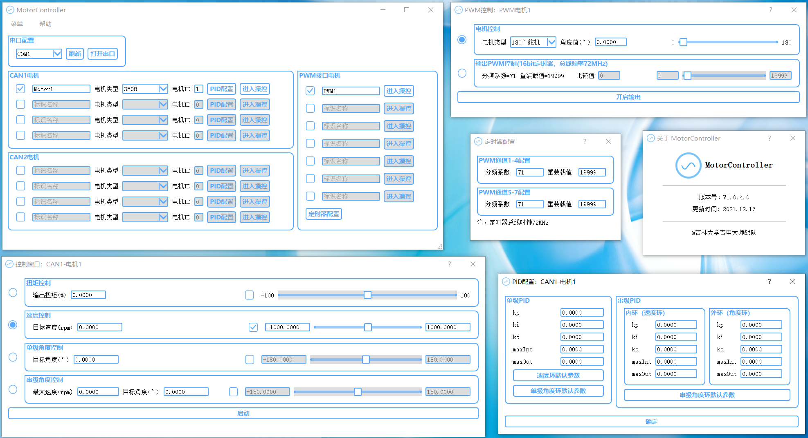

# MotorController电机控制程序

---

## 介绍

`MotorController`是专门为 RoboMaster 比赛相关电机编写的控制程序，用户可以使用电脑软件直接操控电机的动作

**使用方式简介：**

1. 烧录下位机程序（可烧录一次后固定作为电机测试板）

2. 用USB线连接下位机和电脑

3. 在上位机中配置电机信息，进行操控

4. 可将所有配置导出到文件，或从文件中导入配置

**程序运行环境：**

* 上位机：Windows系统

* 下位机：大疆RM官方C板

**支持的电机类型：**

* 大疆 M3508 / GM6020 / M2006 电机

* 180°舵机 / 270°舵机

* 其他使用PWM控制的电机（可自定义PWM输出）

**支持的控制方式**（CAN电机）：

* 扭矩控制（控制扭矩百分比）

* 单级PID速度控制

* 单级/串级PID角度控制

**软件界面：**

---

## 开始使用

1. 下载最新发行版中的ZIP文件，其中包含`上位机软件`和`下位机程序`两个文件夹

2. 使用 Keil5 打开下位机程序，将其烧入一块大疆RM官方C板中

3. 连接电机、主控板、电脑间的电源和数据线

4. 双击运行上位机软件中的`MotorController.exe`，配置电机信息，进行操控

5. 更详细的操作说明请见帮助文档 [转到帮助文档](QT/README.md)

---

## 开发说明

> 注：若您希望参与贡献，可以阅读本段说明，若仅需使用软件，则跟随以上【开始使用】操作即可

**开发环境：**

* 下位机

    * IDE：Keil uVision V5

    * 生成工具：STM32CubeMX V5.6.0

    * HAL固件包版本：FW_F4 V1.25.0

* 上位机

    * IDE：Qt Creator

    * QT 版本：5.9.9

**文件结构：**

* 下位机代码工程为`STM32`目录，主要代码包含在`STM32/USER`中：

    * `USER_CAN.c/h`：CAN初始化、发送和接收

    * `MotorCtrl.c/h`：CAN/USB协议解析、电机控制

    * `Led.c/h`：LED闪烁控制

* 上位机代码工程为`QT`目录：

    * `MainWindow.cpp/h`：主窗口

    * `ctrldialog.cpp/h`：CAN电机控制窗口

    * `pwmctrldialog.cpp/h`：PWM电机控制窗口

    * `piddialog.cpp/h`：PID参数配置窗口

    * `timconfdialog.cpp/h`：定时器参数配置窗口

    * `help.html`、`img`：帮助页面及其图片，由`QT/README.md`生成，需在编译后手动放置于可执行文件所在目录

    * `qss`：QSS样式文件，包含明亮和黑暗两种样式

**主要逻辑简介：**

* 下位机将USB设置为了虚拟串口，因此当与电脑通过USB直连后会被识别为一个串口设备，上下位机以此进行通信

* 用户在上位机中进行的每一步操作，都会通过串口发出指令同步至下位机

* 控制CAN电机时，下位机程序会根据所设定的电机型号、电调ID确定CAN协议帧的收发ID，然后根据所设定的PID参数和目标量定时进行PID计算然后发送CAN控制帧

* 进行PWM控制时，上位机根据所设定的电机型号计算出所需的定时器比较值，下位机接收到后直接写入定时器中
